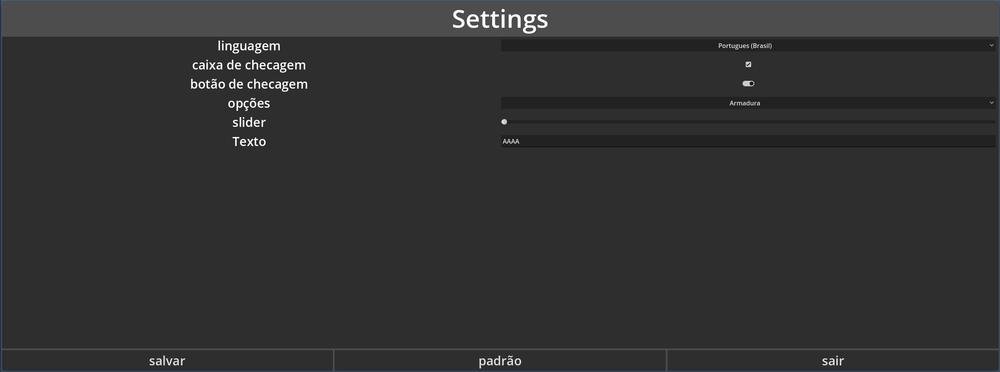
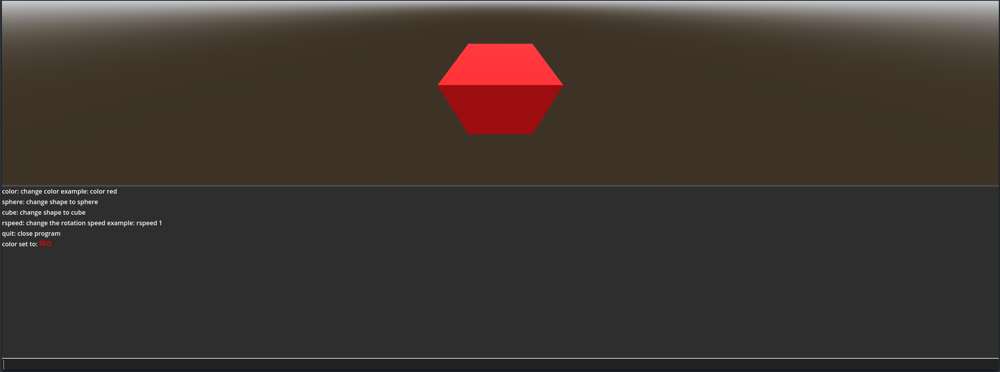

### Lazy Menu 2

## A lazy plugin for lazy people to create lazy menus.

## Features
- automation for creating configuration menus
- automation for key rebinding
- automation for console creation
- demos for reference

## How use
- create a LazyConsoleBuilder or LazyRebindBuilder or LazySettingsBuilder
- configure the builder node
- click in build on the 2D editor
- Create a script so set it up
