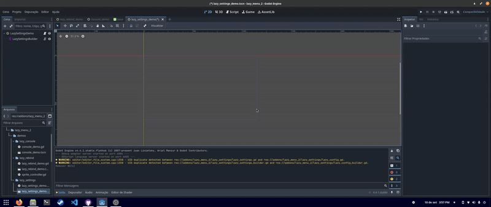

# Lazy Menu 2

## A lazy plugin for lazy people to create lazy menus.

## Features
- automation for creating settings menus
- automation for creating key rebinding menus 
- automation for creating consoles
- demos for reference
- localization suport

## How use
- create a LazyConsoleBuilder or LazyRebindBuilder or LazySettingsBuilder
- configure the builder node
- click in build on the 2D editor
- create a script to add behavior
- remenber to set application -> config -> custom_user_dir_name on the settings
